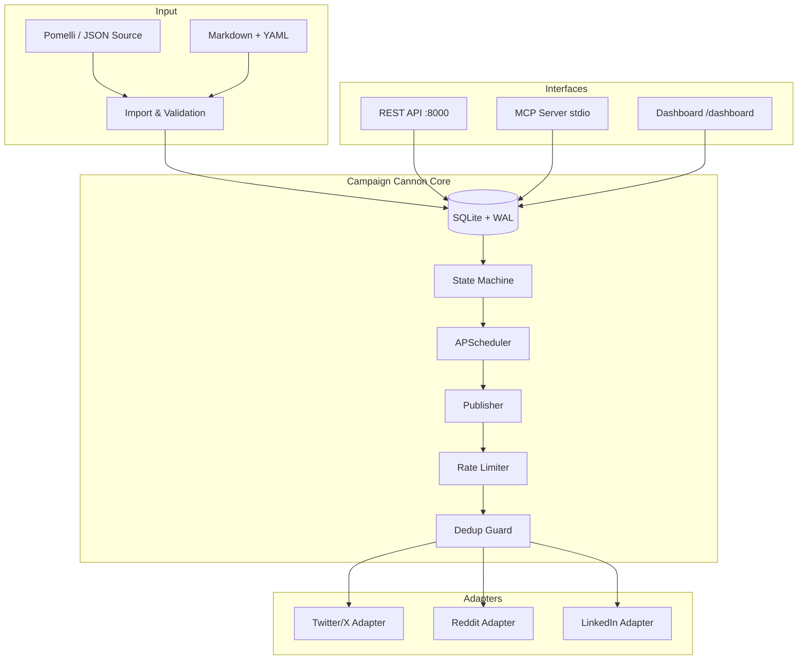

# Campaign Cannon v3.1

Bulletproof social media campaign automation engine. JSON-first campaign import, state machine execution, multi-platform publishing.

> "Reliable delivery engine only — not another marketing brain."

Content comes from Pomelli (or any JSON source). Campaign Cannon handles reliable scheduling, state management, and multi-platform publishing to Twitter/X, Reddit, and LinkedIn.

## Architecture



### Post State Machine

```
DRAFT → SCHEDULED → QUEUED → PUBLISHING → POSTED (terminal success)
                                  ↓
                               FAILED → RETRY → QUEUED (loop back)
                                  ↓
                              DEAD_LETTER (terminal failure after max retries)
```

- **Optimistic locking** via version column prevents concurrent corruption
- **Every transition** logged to PostLog audit table
- **Stuck-post recovery**: PUBLISHING > 5 min → auto-reset to QUEUED
- **Max retries**: 3, exponential backoff: 30s, 120s, 480s

## Quick Start

Get from clone to first campaign in under 5 minutes:

```bash
# 1. Clone and install
git clone <repo-url> campaign-cannon
cd campaign-cannon
pip install -e ".[dev]"

# 2. Configure
cp .env.example .env
# Edit .env — fill in your API credentials (Twitter, Reddit, LinkedIn)

# 3. Start the server
campaign-cannon
# → API at http://localhost:8000
# → Dashboard at http://localhost:8000/dashboard
# → API docs at http://localhost:8000/docs

# 4. Seed demo data (optional)
python scripts/seed.py

# 5. Import a campaign
curl -X POST http://localhost:8000/api/v1/campaigns \
  -H "Content-Type: application/json" \
  -d @examples/demo-campaign.json
```

## Configuration

### Environment Variables (`.env`)

| Variable | Description | Required |
|----------|-------------|----------|
| `CANNON_MASTER_KEY` | AES-256 encryption key for credentials | Yes |
| `CANNON_DB_PATH` | SQLite database path | No (default: `./data/campaign_cannon.db`) |
| `CANNON_LOG_LEVEL` | Log level: DEBUG, INFO, WARNING, ERROR | No (default: `INFO`) |
| `TWITTER_CLIENT_ID` | Twitter OAuth2 client ID | For Twitter |
| `TWITTER_CLIENT_SECRET` | Twitter OAuth2 client secret | For Twitter |
| `TWITTER_ACCESS_TOKEN` | Twitter access token | For Twitter |
| `TWITTER_ACCESS_TOKEN_SECRET` | Twitter access token secret | For Twitter |
| `REDDIT_CLIENT_ID` | Reddit OAuth2 client ID | For Reddit |
| `REDDIT_CLIENT_SECRET` | Reddit OAuth2 client secret | For Reddit |
| `REDDIT_USERNAME` | Reddit username | For Reddit |
| `REDDIT_PASSWORD` | Reddit password | For Reddit |
| `LINKEDIN_CLIENT_ID` | LinkedIn OAuth2 client ID | For LinkedIn |
| `LINKEDIN_CLIENT_SECRET` | LinkedIn OAuth2 client secret | For LinkedIn |
| `LINKEDIN_ACCESS_TOKEN` | LinkedIn access token | For LinkedIn |
| `CANNON_ALERT_WEBHOOK_URL` | Slack/Discord webhook for error alerts | No |

### Config File (`config.toml`)

```toml
[general]
app_name = "Campaign Cannon"
log_level = "INFO"           # Overridden by CANNON_LOG_LEVEL env var
log_format = "json"          # "json" or "console"

[database]
path = "./data/campaign_cannon.db"
wal_mode = true
busy_timeout_ms = 5000

[scheduler]
misfire_grace_time = 300     # Seconds — missed jobs still fire within this window
max_concurrent_publishes = 3
stuck_post_timeout = 300     # Seconds before PUBLISHING → QUEUED recovery

[retry]
max_retries = 3
backoff_base = 30            # Exponential: 30s, 120s, 480s
backoff_multiplier = 4

[rate_limits]
twitter_posts_per_window = 300
twitter_window_seconds = 10800   # 3 hours
reddit_posts_per_minute = 1
linkedin_posts_per_day = 100

[media]
max_image_size_mb = 20
max_video_size_mb = 512

[api]
host = "0.0.0.0"
port = 8000
cors_origins = ["http://localhost:3000", "http://localhost:8000"]

[dashboard]
enabled = true
refresh_interval = 5         # Seconds
```

## API Reference

Base URL: `http://localhost:8000/api/v1`

### The 5-Call Campaign Lifecycle

#### 1. Import Campaign

```http
POST /api/v1/campaigns
Content-Type: application/json
```

```json
{
  "name": "Product Launch",
  "slug": "product-launch-q1",
  "description": "Q1 2026 product launch campaign",
  "posts": [
    {
      "slug": "tweet-announce",
      "platform": "twitter",
      "body": "Excited to announce our new product! #launch",
      "scheduled_at": "2026-03-15T09:00:00Z"
    },
    {
      "slug": "reddit-announce",
      "platform": "reddit",
      "title": "We just launched — AMA!",
      "body": "Hey r/startups! We've been building...",
      "scheduled_at": "2026-03-15T10:00:00Z"
    }
  ]
}
```

**Response** `201 Created`:
```json
{
  "id": "550e8400-e29b-41d4-a716-446655440000",
  "name": "Product Launch",
  "slug": "product-launch-q1",
  "status": "draft",
  "posts_count": 2
}
```

#### 2. Activate Campaign

```http
POST /api/v1/campaigns/{id}/activate
```

**Response** `200 OK`:
```json
{
  "id": "550e8400-...",
  "status": "active",
  "posts_scheduled": 2
}
```

#### 3. Check Status

```http
GET /api/v1/campaigns/{id}/status
```

**Response** `200 OK`:
```json
{
  "id": "550e8400-...",
  "name": "Product Launch",
  "status": "active",
  "total_posts": 2,
  "by_state": {
    "queued": 1,
    "posted": 1
  },
  "next_post_at": "2026-03-15T10:00:00Z"
}
```

#### 4. Pause Campaign

```http
POST /api/v1/campaigns/{id}/pause
```

**Response** `200 OK`:
```json
{
  "id": "550e8400-...",
  "status": "paused",
  "jobs_removed": 1
}
```

#### 5. Resume Campaign

```http
POST /api/v1/campaigns/{id}/resume
```

**Response** `200 OK`:
```json
{
  "id": "550e8400-...",
  "status": "active",
  "posts_rescheduled": 1
}
```

### Additional Endpoints

| Method | Path | Description |
|--------|------|-------------|
| `GET` | `/health` | Health check |
| `GET` | `/api/v1/campaigns` | List all campaigns |
| `GET` | `/api/v1/campaigns/{id}` | Get campaign detail |
| `GET` | `/api/v1/campaigns/{id}/export` | Export campaign as JSON |
| `POST` | `/api/v1/campaigns` | Import campaign (with `?dry_run=true` option) |
| `GET` | `/dashboard/` | HTML status dashboard |

### Error Responses

All errors follow this format:

```json
{
  "detail": "Campaign not found",
  "status_code": 404
}
```

| Status | Meaning |
|--------|---------|
| `400` | Bad request (invalid JSON, missing fields) |
| `404` | Campaign or post not found |
| `409` | Conflict (campaign already active, state transition invalid) |
| `422` | Validation error (Pydantic field errors) |
| `429` | Rate limited |
| `500` | Internal server error |

## MCP Integration

Campaign Cannon exposes an MCP (Model Context Protocol) server for AI agent integration via stdio transport.

```bash
# Run as MCP server
campaign-cannon --mcp
```

Available MCP tools:
- `import_campaign` — Import a campaign from JSON
- `activate_campaign` — Activate a campaign
- `get_campaign_status` — Check campaign progress
- `pause_campaign` — Pause a running campaign
- `resume_campaign` — Resume a paused campaign
- `list_campaigns` — List all campaigns

## Docker Deployment

### Quick Start with Docker

```bash
# Build and run
docker compose up -d

# Check health
curl http://localhost:8000/health

# View logs
docker compose logs -f

# Stop
docker compose down
```

### Docker Details

- **Multi-stage build**: Builder stage installs dependencies, runtime stage is minimal
- **Non-root user**: Runs as UID 1000 (`cannon`)
- **Health check**: `/health` endpoint checked every 30s
- **Volumes**: `./data` (SQLite) and `./campaigns` (media) persist across restarts
- **Restart policy**: `unless-stopped`

### Custom Configuration

```bash
# Use custom .env
docker compose --env-file .env.production up -d

# Override port
docker compose run -p 9000:8000 campaign-cannon

# Shell access
docker compose exec campaign-cannon bash
```

## Development

### Setup

```bash
# Install with dev dependencies
pip install -e ".[dev]"

# Run tests
pytest

# Run tests with coverage
pytest --cov=campaign_cannon --cov-report=html

# Run specific test suite
pytest tests/unit/test_state_machine.py -v
pytest tests/integration/ -v

# Lint
ruff check src/ tests/
ruff format src/ tests/
```

### Project Structure

```
campaign-cannon/
├── src/campaign_cannon/
│   ├── api/              # FastAPI REST endpoints
│   │   ├── app.py        # Main app + routes
│   │   └── schemas.py    # Pydantic request/response models
│   ├── config/           # Pydantic Settings + TOML loader
│   │   └── settings.py   # Settings class
│   ├── db/               # SQLAlchemy models + connection
│   │   ├── models.py     # Campaign, Post, MediaAsset, PostLog
│   │   └── connection.py # Engine + session factory
│   ├── engine/           # Core business logic
│   │   ├── state_machine.py  # Post state transitions
│   │   ├── publisher.py      # Publish orchestration
│   │   ├── dedup.py          # Idempotency + duplicate detection
│   │   └── rate_limiter.py   # Token bucket rate limiter
│   ├── adapters/         # Platform adapters
│   │   ├── base.py       # BaseAdapter + PlatformResult
│   │   ├── twitter.py    # Twitter/X via Tweepy
│   │   ├── reddit.py     # Reddit via PRAW
│   │   └── linkedin.py   # LinkedIn via httpx
│   ├── media/            # Media validation
│   │   └── validators.py # Platform-specific size/type checks
│   ├── import_/          # Campaign import
│   │   ├── json_import.py    # JSON import pipeline
│   │   └── validator.py      # Import payload validation
│   ├── mcp/              # MCP server
│   │   └── server.py     # MCP tools for AI agents
│   └── dashboard/        # Status dashboard
│       └── app.py        # HTML dashboard (FastAPI router)
├── tests/
│   ├── conftest.py       # Shared fixtures
│   ├── unit/             # Unit tests (mocked dependencies)
│   └── integration/      # Integration tests (mock adapters)
├── scripts/
│   ├── seed.py           # Demo data seeder
│   └── backup.py         # Backup & restore
├── config.toml           # Non-secret configuration
├── .env.example          # Environment variable template
├── Dockerfile            # Multi-stage Docker build
├── docker-compose.yml    # Docker Compose configuration
└── pyproject.toml        # Project metadata + dependencies
```

### Scripts

```bash
# Seed demo data
python scripts/seed.py

# Create backup
python scripts/backup.py

# List backups
python scripts/backup.py --list

# Restore latest backup
python scripts/backup.py --restore latest

# Restore specific backup
python scripts/backup.py --restore backups/campaign_cannon_backup_20260315_090000.tar.gz
```

## Troubleshooting

### Database locked

SQLite with WAL mode handles concurrent reads well, but only one writer at a time. If you see "database is locked":

1. Check `busy_timeout_ms` in `config.toml` (default: 5000ms)
2. Ensure no other process has an exclusive lock
3. Run `python -c "import sqlite3; sqlite3.connect('data/campaign_cannon.db').execute('PRAGMA wal_checkpoint(TRUNCATE)')"`

### Posts stuck in PUBLISHING

The stuck-post recovery runs automatically. Posts in PUBLISHING for >5 minutes are reset to QUEUED. Check:

1. Logs: `grep "auto-recovery" campaign_cannon.log`
2. Dashboard: PUBLISHING count should be 0 or 1 during normal operation
3. Config: Adjust `stuck_post_timeout` in `config.toml`

### Rate limiting

If posts aren't publishing on schedule:

1. Check rate limiter state in the dashboard
2. Verify platform limits in `config.toml` under `[rate_limits]`
3. Twitter free tier: 300 posts per 3 hours
4. Reddit: ~1 post per minute
5. LinkedIn: ~100 posts per day

### Platform authentication errors

1. Verify credentials in `.env`
2. Check token expiration (especially LinkedIn, which expires)
3. Test with: `curl http://localhost:8000/health` — the health check validates credential decryption

### Docker issues

```bash
# Check container logs
docker compose logs campaign-cannon

# Verify volumes are mounted
docker compose exec campaign-cannon ls -la /app/data /app/campaigns

# Reset (WARNING: destroys data)
docker compose down -v
docker compose up -d --build
```

## Tech Stack

- **Python 3.11+**
- **SQLAlchemy 2.0** + Alembic (SQLite with WAL)
- **FastAPI** + Uvicorn
- **APScheduler 3.x** (SQLite job store)
- **Tweepy** (Twitter/X), **PRAW** (Reddit), **httpx** (LinkedIn)
- **Pydantic v2** (config + validation)
- **structlog** (JSON logging)
- **cryptography** (Fernet AES-256 for credential encryption)

## License

MIT
